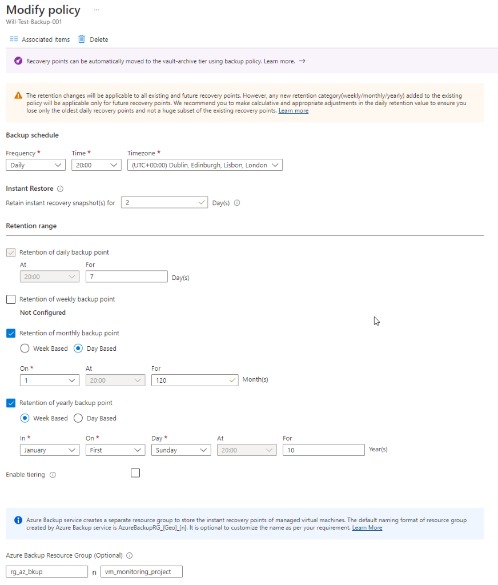

## 1.1. Create the below resources in the FW-Azure Production subscription

1. Create the resource group, example, `rg-<customername>-<region>-<prod/dev>-backups-01`.
2. Create a recovery services vault to store the backups (GRS is the preferred option, LRS for lowest cost), example, `rsv-<customername>-<region>-<prod/dev>-backup-01`.
3. Create a log analytics workspace or reuse another one, example, `la-<customername>-<region>-<prod/dev>-backup-01`.

## 1.2. Configure Backup Policy

Configure the backup policy in-line with the SC team standard being used for other customers, this has been provided to me.

- Suggested Name format: `Bkup-policy-<time of day>-<policy type>`.
- Example name: `bkup-policy-nightly-std`.

## 1.3. Configure Alerting

Note that this method is using the old backup alerting method, this is being replaced by Azure Monitor.

[Microsoft Link for more information](https://learn.microsoft.com/en-us/azure/backup/backup-azure-monitoring-built-in-monitor?tabs=recovery-services-vaults#turning-on-azure-monitor-alerts-for-job-failure-scenarios)

Configure diagnostic logs to be sent from Azure Backup to the Log Anlytics workspace above.

From the Recovery services vault just setup. Click on Backup Alerts, under the Monitoring section.Click Configure Notifications.

- Enable Notifications: Yes
- Recipients(Email): monitoring@DomainName.com
- Notify: Hourly digest
- Severity: Critical & Warning

### 1.3.1. Example notifiation config

## 1.4. Configure Diagnostic log collection

Configure diagnostic logs to be sent from Azure Backup to the Log Anlytics workspace above.

1. Navigate to Diagnostic settings under Monitoring.
2. Click Add Diagnostic Settings.
3. Name your diagnostic setting, something informational, for example, "AzBkup-Diagnostics", suggestion, `Backup Report Data`.
4. Select Send to Log Analytics Workspace.
5. Add a workspace and don't touch any other settings.
6. Hit Save.

Make sure to run the initial backup job from the Azure Backup Dashboard.