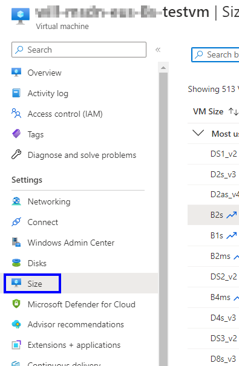

## 1. Before you begin

- Shutdown the VM from within it's OS if possible (Not always necessary at all but, nice to do).
- If you cannot see the VM size that you're looking for it may not be compatible with your VM.

> You can have too many disk or NICs attached to the VM for the size you want. The typ of disks that you have attached can limit your options, premium and standard tier.

## 2. Re-siging the vm

Open the Azure portal.
Open the page for the virtual machine.

In the left menu, select Size.

> Note: De-allocating the VM also releases any dynamic IP addresses assigned to the VM. The OS and data disks are not affected. If you are resizing a production VM, consider using Azure Capacity Reservations to reserve Compute capacity in the region.

Pick a new size from the list of available sizes and then select Resize.
