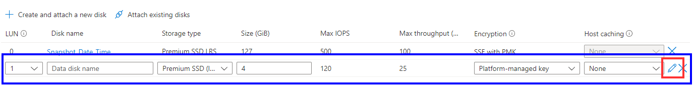
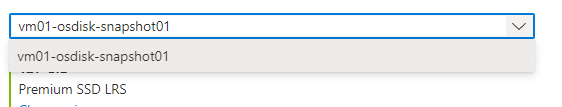
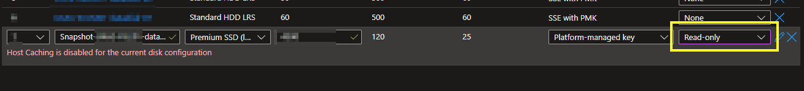

## 1. Before you begin

- Confirm snapshot data is valid.

## 2. Create your snapshot

Navigate to a VM that is available to have a disk attached to it.
Click Disks.
Create new disk.

Click Edit on the far right hand side. As shown in red above.
Name your Disk, I'd suggest, snapshot_ServerName_Date_Time
Source, select snapshot.

Select the Snapshot you wish to attach.

Make any changes to the Encryption Type.
I'd suggest it not to be a shared disk.
Press Save.

This shouldn't take too long.

> If you see the error below, change the Host Caching optio
n to "none".

## 3. Confirm disk is visibile in the OS

The share should be available from the get go however, you may need to bring the disk online within computer management.

1. RDP into your VM & check File Explorer for your disk, the name will be what the share was called originally.
2. Open Computer Management, Click Disk Management.
3. Right-Click on the disk, mark it as Oneline.
4. You should now see it in File Explorer.

## 4. Detach the disk

1. Close any open sessions to the disk that you attached.
2. Navigate back to the VM in Azure Management Portal.
3. Click the X button next to the disk.
