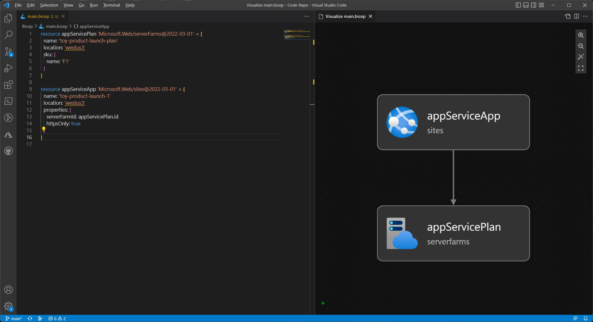

# Bicep CheatSheet

## Defining Resources

Example Bicep file.

```bicep
resource storageAccount 'Microsoft.Storage/storageAccounts@2022-09-01' = {
  name: 'toylaunchstorage'
  location: 'westus3'
  sku: {
    name: 'Standard_LRS'
  }
  kind: 'StorageV2'
  properties: {
    accessTier: 'Hot'
  }
}
```
The `resource` keyword at the start tells Bicep that you're about to define a resource.

Next, you give the resource a `symbolic name`. In the example, the resource's symbolic name is **storageAccount**. 

:::important
Symbolic names are used within Bicep to refer to the resource, but they won't ever show up in Azure.
:::

`Microsoft.Storage/storageAccounts@2022-09-01` is the **resource type** and **API version** of the resource. Microsoft.Storage/storageAccounts tells Bicep that you're declaring an Azure storage account. The date `2022-09-01` is the **version of the Azure Storage API** that Bicep uses when it creates the resource.

You have to** declare a resource name**, which is the name the storage account will be assigned in Azure. You'll set a resource name using the `name` keyword.

:::caution
Resource names often have rules you must follow, like maximum lengths, allowed characters, and uniqueness across all of Azure. The requirements for resource names are different for each Azure resource type.
:::

You'll then set other details of the resource, such as its **location**,**SKU (pricing tier)**, and **kind**. In this example, we're setting the storage account's access tier to Hot.

:::tip
There are also properties you can define that are different for each resource type. Different API versions might introduce different properties, too. 
:::

### Resource Dependancies

You might have to extract some information from one resource to be able to define another. Or, if you're deploying a web application, you'll have to create the server infrastructure before you can add an application to it. These relationships are called **dependencies**.

We need to deploy an App Service app for the template, before that can be done, we need to deploy an App Service Plan.

Below we are deploying the App Service Plan.

```bicep
resource appServicePlan 'Microsoft.Web/serverFarms@2022-03-01' = {
  name: 'toy-product-launch-plan'
  location: 'westus3'
  sku: {
    name: 'F1'
  }
}
```

Above we are deploying an **App Service plan** that has the **resource type** `Microsoft.Web/serverFarms`. The plan resource is **named** `toy-product-launch-plan`, and it's deployed into the `West US 3` **region**. It uses a pricing **SKU of** `F1`, which is the free tier of App Service.

Next, we must declare the App itself.

```bicep
resource appServiceApp 'Microsoft.Web/sites@2022-03-01' = {
  name: 'toy-product-launch-1'
  location: 'westus3'
  properties: {
    serverFarmId: appServicePlan.id
    httpsOnly: true
  }
}
```

This template instructs Azure to host the app on the plan we just created. 
Notice that the definition of the plan includes the **symbolic name of the App Service plan** on this line: `serverFarmId: appServicePlan.id`. This line means that Bicep will get the **App Service plan's resource ID** using the id property. It's effectively saying, this app's server farm ID is the ID of the App Service plan defined earlier.

:::tip
In Azure, a `resource ID` is a unique identifier for each resource. The resource ID includes the Azure subscription ID, the resource group name, and the resource name, along with some other information.
:::

By declaring the app resource with a property that references the symbolic name of the plan, Azure understands the **implicit dependency** between the App Service app and the plan.



## Further Notes and Exercises

[Microsoft Learn link - Build your first Bicep template](https://learn.microsoft.com/en-us/training/modules/build-first-bicep-template/4-exercise-define-resources-bicep-template?pivots=powershell).