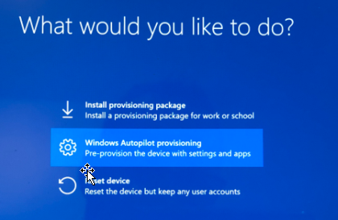
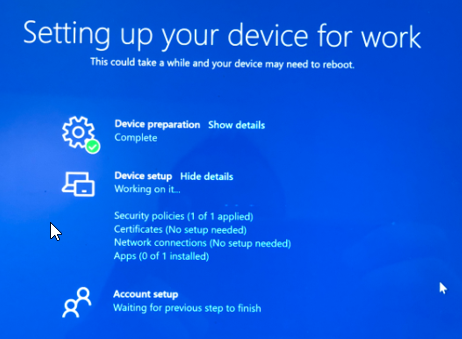

Description: Perform an AutoPilot Reset on a Windows Device.

## 1. Prerequisit Steps in Intune

Logon to Microsoft Endpoint Manager admin centre: https://endpoint.microsoft.com/

### 1.1. Confirm the device has the correct group tag

> Ignore this step if you know you do not use group tags.

Sometimes group tags within Autopilot are used to assign device profiles\policies after the device has been enrolled.

This group tag must be correct otherwise it'll interfer with the reset.

1. Click **Devices** > Windows > Windows Enrollment > Devices.
2. Find the **Serial number** of the device **and search it** here.
3. **Click** on **your device**, **alter** group tag** here to the correct one.
4. Click Save

> **Wait** for the profile status to change to assigned, this is automatic and can take 5 - 10 minutes.

## 2. Initiate the reset

> The Windows device **MUST** have a stable internet connection to complete this process.

1. **Click** Devices > Windows > Windows Devices, it should already be on this option.
2. **Search** for your device and **click on the device name**.
3. Click the **Autopilot Reset option**.
4. Click **Yes**.

> Wait for the Windows device to reset, it must maintain internet connection throughout this process.

## 3. On the device

1. Make sure the **machine is powered on** and **connected to an internet source**.
2. The Autopilot process should start automatically.
3. When the option appears, **select Windows Autopilot provisioning**.

Autopilot should take over from here and reset the device.

Once completed you should then be returned to a login prompt.

