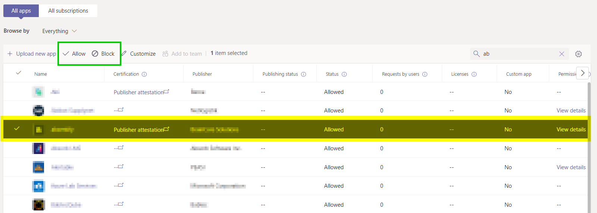

Description: Approve or block an app for the organisation.

[Microsoft Article for this.](https://learn.microsoft.com/en-US/microsoftteams/manage-apps?WT.mc_id=TeamsAdminCenterCSH#allow-and-block-apps)

## 1. Steps to complete

1. Login to Teams Admin Centre, https://admin.teams.microsoft.com/
2. Click Teams Apps > Manage apps.
3. In the section towards the bottom of the page, search for the applicaton and select it.

4. Click on Allow or Block in the action bar above the list.
